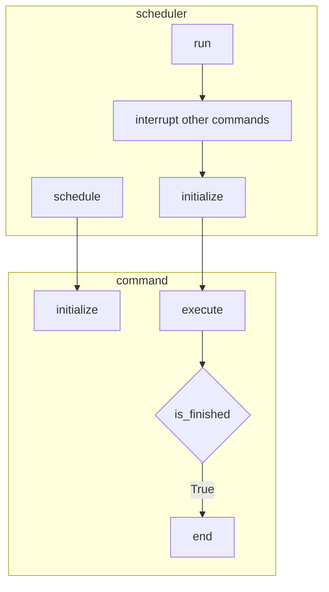

# Command Based robot framework

* WPILib documentation: 
  * [Command based programming](https://docs.wpilib.org/en/stable/docs/software/commandbased/index.html)
  * [Scheduler](https://docs.wpilib.org/en/stable/docs/software/commandbased/command-scheduler.html)

## Commands / Scheduler state flow

